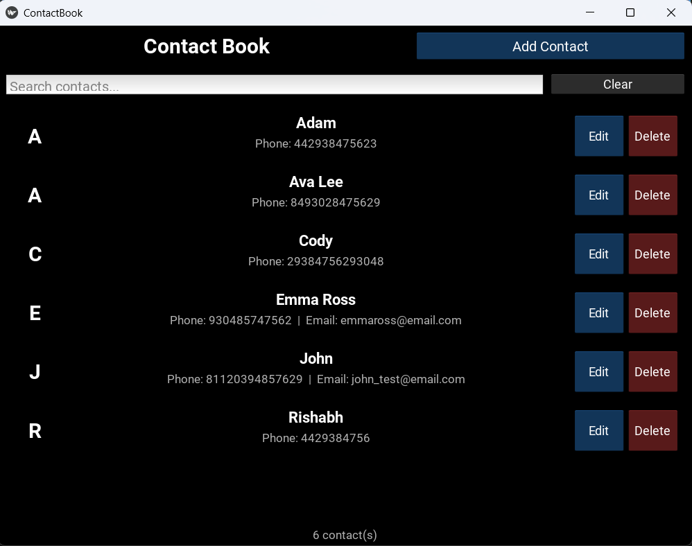
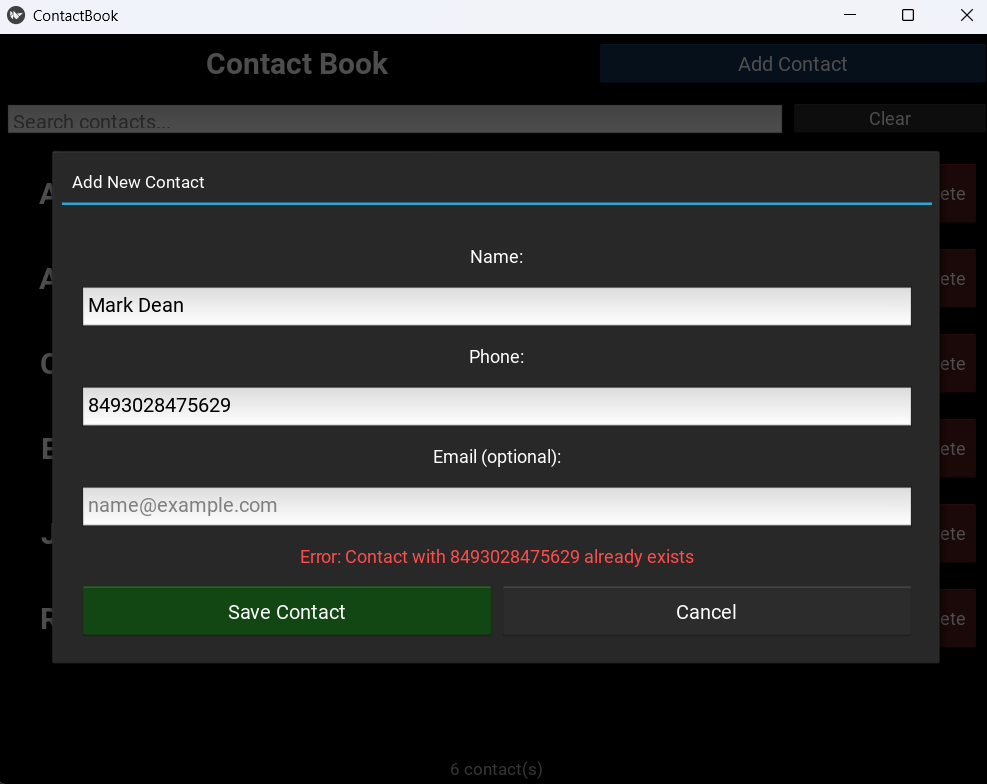

# Contact Book

A professional contact management application showcasing **clean architecture**, **SOLID principles**, and **modern Python development practices**. Built with a robust backend architecture and a cross-platform Kivy GUI.




## 🎯 Project Overview

This Contact Book application is designed as a demonstration of professional software engineering practices, with particular emphasis on:

- **SOLID Principles** - Single Responsibility, Open/Closed, Liskov Substitution, Interface Segregation, Dependency Inversion.
- **Clean Architecture** - Clear separation of concerns with distinct layers.
- **Test-Driven Development** - Comprehensive test coverage with pytest.
- **Type Safety** - Type hints and validation.
- **Design Patterns** - Repository pattern, Factory pattern, Dependency Injection.


## 🏗️ Architecture

### **Layered Architecture**
```
Contact_Book/
│
├── 📂 contact/              # Domain Layer - Business Entities
│   ├── contact.py           # Contact entity (immutable dataclass)
│   ├── contact_validator.py    # Validation logic
│   ├── contact_serializer.py   # Serialization/Deserialization
│   └── contact_factory.py      # Contact creation with validation
├── 📂 core/                 # Core Layer - Abstractions
│   ├── interfaces.py        # Abstract interfaces (IStorageBackend, IOutputHandler)
│   └── contact_constants.py # Domain constants and constraints
├── 📂 data/
├── 📂 img/
├── 📂 logs/
├── 📂 presentation/         # Presentation Layer - UI
│   └── cli/                 
│   └── gui/                 # Kivy GUI implementation
│       ├── app.py
│       ├── screens/
│       ├── widgets/
│       └── dialogs/
├── 📂 storage/
│   └── json_storage.py  # JSON file persistence implementation
├── 📂 repositories/         # Data Access Layer
│   └── contact_repository.py   # Contact management & CRUD operations
└── 📂 utils/                # Cross-Cutting Concerns
    ├── decorators.py        # Logging, error handling decorators
    ├── exceptions.py        # Custom exception hierarchy
    └── logger.py            # Logging configuration
```


## 🎨 SOLID Principles Implementation

### **Single Responsibility Principle (SRP)**
Each class has ONE reason to change:
- `Contact` - Represents contact data only
- `ContactValidator` - Validates contact fields only
- `ContactRepository` - Manages contact collection only
- `JsonStorage` - Handles file I/O only

### **Open/Closed Principle (OCP)**
- `IStorageBackend` interface allows new storage implementations without modifying existing code
- New storage types (CSV, Database) can be added by implementing the interface

### **Liskov Substitution Principle (LSP)**
- Any implementation of `IStorageBackend` can replace `JsonStorage` without breaking functionality
- Repository works with any storage backend through the interface

### **Interface Segregation Principle (ISP)**
- `IStorageBackend` - Minimal interface (read/write only)
- `IOutputHandler` - Single method interface for output
- No fat interfaces forcing unnecessary implementations

### **Dependency Inversion Principle (DIP)**
- `ContactRepository` depends on `IStorageBackend` abstraction, not concrete `JsonStorage`
- High-level modules do not depend on low-level modules
- Dependencies are injected, not hard-coded


## 🔧 Technical Stack

### **Backend**
- **Python 3.10+** - Core language
- **json** - Data persistence
- **typing** - Type safety

### **Testing**
- **pytest** - Testing framework
- **pytest-cov** - Coverage reporting

### **Frontend**
- **Kivy** - Cross-platform GUI framework

### **Code Quality**
- **Type hints** - Full typing support
- **Custom exceptions** - Clear error handling
- **Logging** - Comprehensive operation tracking


## 📦 Installation

### **Prerequisites**
- Python 3.10 or higher
- pip (Python package manager)

### **Setup**

1. **Clone the repository:**
```bash
git clone https://github.com/RishabhSinghal04/Contact_Book
cd Contact_Book
```

2. **Create virtual environment (recommended):**
```bash
python -m venv venv

# Windows
venv\Scripts\activate

# Linux/Mac
source venv/bin/activate
```

3. **Install dependencies:**
```bash
pip install -r requirements.txt
```

**requirements.txt:**
```
kivy>=2.3.0
pytest>=7.4.0
pytest-cov>=4.1.0
```


## 🚀 Usage

### **Run the Application**
```bash
python main.py
```

### **Run Tests**
```bash
# Run all tests
pytest

# Run with coverage
pytest --cov=. --cov-report=html

# Run specific test file
pytest tests/test_contact.py -v

# Run with detailed output
pytest -v --tb=short
```


## 🧪 Testing Strategy

### **Test Coverage**
```
tests/
├── test_contact.py          # Contact entity tests
├── test_validator.py        # Validation logic tests
├── test_repository.py       # Repository CRUD tests
└── conftest.py              # Pytest fixtures
```

### **Test Philosophy**
- **Unit Tests** - Isolated component testing
- **Integration Tests** - Repository + Storage interaction
- **Fixtures** - Reusable test setup with pytest fixtures
- **Parametrized Tests** - Multiple scenarios with single test
- **Coverage Goals** - 90%+ code coverage


## 🗂️ Data Persistence

### **Storage Format: JSON**
```json
[
  {
    "name": "John Doe",
    "phone_num": "1234567890",
    "email": "john@example.com"
  },
  {
    "name": "Jane Smith",
    "phone_num": "9876543210",
    "email": null
  }
]
```

### **Storage Location**
- Default: `data/contacts.json`
- Configurable via `JsonStorage` initialization
- Auto-creates directory and file if missing


## 📋 Core Features

### **Contact Management**
- ✅ Add new contacts with validation
- ✅ Edit existing contacts (name, email)
- ✅ Delete contacts with confirmation
- ✅ Search by name (case-insensitive)
- ✅ Search by phone number
- ✅ View all contacts (sorted alphabetically)

### **Data Validation**
- **Name**: 1-20 characters, alphanumeric with spaces
- **Phone**: 7-15 digits (accepts formatting: dashes, spaces, parentheses)
- **Email**: Valid email format (optional field)

### **Error Handling**
- Custom exception hierarchy
- Graceful error recovery
- User-friendly error messages
- Comprehensive logging


## 🎨 Design Patterns

### **Repository Pattern**
```python
# Abstraction over data storage
repository = ContactRepository(storage)
repository.add(contact)
contacts = repository.get_all()
```

### **Factory Pattern**
```python
# Centralized contact creation with validation
contact = ContactFactory.create_contact(input_handler, output_handler)
```

### **Dependency Injection**
```python
# Dependencies injected, not hard-coded
storage = JsonStorage("data/contacts.json")
repository = ContactRepository(storage)  # Inject dependency
```

### **Strategy Pattern**
```python
# Swappable storage implementations
storage = JsonStorage()  # Or CsvStorage, DatabaseStorage, etc.
repository = ContactRepository(storage)
```


## 🔍 Key Design Decisions

### **1. Phone Number as Unique Identifier**



- **Why**: More reliable than name (duplicates common)
- **Implementation**: Hash and equality based on phone only
- **Implication**: Cannot change phone number (create new contact instead)

### **2. Immutable Contact Entity**
```python
@dataclass(frozen=True, eq=False)
class Contact:
    # Immutable - prevents accidental modification in set
```

### **3. Validation at Multiple Layers**
- Input layer: Basic format validation
- Domain layer: Business rule validation
- Ensures data integrity throughout

### **4. Separation of Storage and Repository**
- **Storage**: How to persist (technical concern)
- **Repository**: What to persist (business concern)
- Clear separation of concerns


## 📊 Performance Considerations

- **O(1) lookups** - Set-based contact storage
- **Lazy loading** - Contacts loaded on initialization
- **Regex caching** - `@lru_cache` on validation patterns
- **Efficient search** - Direct set membership testing


## 🔒 Error Handling

### **Custom Exception Hierarchy**
```python
ContactError (base)
├── ValidationError
├── ContactNotFoundError
├── ContactAlreadyExistsError
└── StorageError
```

### **Graceful Degradation**
- Corrupted storage → Start with empty contact list
- Invalid contact data → Skip and log error
- Storage unavailable → In-memory fallback option


## 📝 Logging

### **Log Levels**
- **DEBUG**: Detailed operation tracking
- **INFO**: Successful operations (add, update, delete)
- **WARNING**: Validation failures, duplicate attempts
- **ERROR**: Storage errors, unexpected failures

### **Log Location**
- File: `logs/contact_book.log`
- Console: Disabled (GUI app)


## 🎨 Frontend

### **GUI Implementation**
The graphical user interface is built with **Kivy**, a modern cross-platform Python framework.

**Features:**
- Clean, modern interface
- Real-time search functionality
- Contact cards with avatars
- Modal dialogs for add/edit operations
- Delete confirmations
- Responsive layout

**Acknowledgment:**
> The Kivy GUI layer was developed with assistance from **Claude (Sonnet 4.5 Extended)** by Anthropic.
> The frontend seamlessly integrates with the robust backend architecture through clean interfaces,
> demonstrating proper separation of concerns between presentation and business logic layers.


## 🛠️ Extending the Application

### **Adding New Storage Backend**
```python
# 1. Implement IStorageBackend interface
class DatabaseStorage(IStorageBackend):
    def read(self) -> list[dict]:
        # Database query logic
        pass
    
    def write(self, data: list[dict]) -> None:
        # Database insert/update logic
        pass

# 2. Use it
storage = DatabaseStorage("connection_string")
repository = ContactRepository(storage)  # Works seamlessly!
```

### **Adding New Validation Rules**
```python
# In ContactValidator
@staticmethod
def validate_phone_num(phone_num: str) -> str:
    # Add new validation logic
    # Update constants in contact_constants.py
    pass
```


## 📚 Learning Resources

This project demonstrates:
- Clean Architecture principles
- SOLID design principles
- Repository pattern
- Dependency Injection
- Test-Driven Development (TDD)
- Type-safe Python development
- Modern Python features (dataclasses, type hints, pathlib)


## 🤝 Contributing

This is an educational project demonstrating software engineering best practices. 

**Areas for Enhancement:**
- Additional storage backends (CSV, SQLite, PostgreSQL)
- Export/Import functionality
- Contact groups/categories
- Profile pictures
- Contact history/audit trail
- Multi-user support


## 🤖 AI-Assisted Development

**Frontend Implementation**
- Kivy GUI developed with assistance from **Claude (Sonnet 4.5 Extended)** by Anthropic.